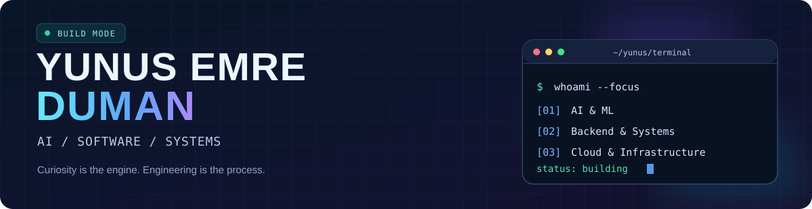

<!--
  GitHub profile of @yunusemre274
  Interactive elements are built with GitHub-supported Markdown/HTML:
  clickable links, navigation anchors, expandable sections and animated SVGs.
-->

<div align="center">
  <a href="https://www.yunusemreduman.com" title="Visit my portfolio">
    
  </a>

  <h1>Hi, I'm Yunus Emre 👋</h1>

  <a href="https://www.yunusemreduman.com">
    
  </a>

  <p>
    <a href="https://www.yunusemreduman.com"></a>
    <a href="https://www.linkedin.com/in/yunus-emre-duman-b8177b309/"></a>
    <a href="https://www.kaggle.com/yunusemreduman"></a>
    <a href="mailto:yunusemreduman274@gmail.com"></a>
  </p>
  <p>
    <a href="https://github.com/yunusemre274?tab=followers"></a>
    
    <a href="https://github.com/yunusemre274?tab=repositories"></a>
  </p>

  <a href="#about">About</a> &nbsp;•&nbsp;
  <a href="#featured-projects">Projects</a> &nbsp;•&nbsp;
  <a href="#tech-stack">Tech Stack</a> &nbsp;•&nbsp;
  <a href="#github-activity">GitHub Activity</a> &nbsp;•&nbsp;
  <a href="#connect">Connect</a>
</div>

---

## About

`> whoami`

I'm a **Computer Engineering student** who enjoys connecting **AI, backend development, Linux, containers and real-world software**. I'm interested in how software behaves under the hood: architecture, performance, reliability and the journey from an idea to a working product.

- 🧠 **AI & ML:** experimenting with models, data workflows, local LLMs and AI agents.
- ⚙️ **Backend & systems:** building APIs, understanding runtime behavior and working with Linux.
- ☁️ **Infrastructure:** learning and applying Docker, Kubernetes and deployment workflows.
- 🛠️ **My approach:** learn the fundamentals, build something useful, measure, then improve.

<details>
  <summary><b>🟣 Click to expand — current focus & engineering mindset</b></summary>
  <br />

  ```text
  CURRENTLY EXPLORING
  ├── PyTorch & practical machine learning
  ├── Local LLMs, inference pipelines and AI agents
  ├── Linux, Docker and Kubernetes internals
  ├── Backend architecture & API design
  └── MLOps, performance and reproducible workflows

  BUILDING PRINCIPLE
  Understand → Prototype → Measure → Refine → Ship
  ```

  I like projects that teach me more than one layer of the stack — from the data and API to the interface and infrastructure.
</details>

## Featured Projects

> **Click any project title or "Explore repository" badge to open its GitHub repo.**

<table>
  <tr>
    <td width="50%" valign="top">
      <h3><a href="https://github.com/yunusemre274/KubeView">🚢 KubeView / Tersane</a></h3>
      <p>A 3D, port-inspired visualization of Kubernetes clusters, resources and activity.</p>
      <p>
        
        
        
      </p>
      <a href="https://github.com/yunusemre274/KubeView"></a>
    </td>
    <td width="50%" valign="top">
      <h3><a href="https://github.com/yunusemre274/SeeFps">🎯 SeeFps</a></h3>
      <p>An ML-based gaming performance prediction and virtual benchmark project.</p>
      <p>
        
        
        
      </p>
      <a href="https://github.com/yunusemre274/SeeFps"></a>
    </td>
  </tr>
  <tr>
    <td width="50%" valign="top">
      <h3><a href="https://github.com/yunusemre274/Notification-Island">🏝️ Notification Island</a></h3>
      <p>A Windows Dynamic Island-style desktop interface with local AI assistance and system integrations.</p>
      <p>
        
        
        
      </p>
      <a href="https://github.com/yunusemre274/Notification-Island"></a>
    </td>
    <td width="50%" valign="top">
      <h3><a href="https://github.com/yunusemre274/MLCalculator">📊 MLCalculator</a></h3>
      <p>A full-stack data exploration and machine-learning model comparison workspace.</p>
      <p>
        
        
        
      </p>
      <a href="https://github.com/yunusemre274/MLCalculator"></a>
    </td>
  </tr>
  <tr>
    <td width="50%" valign="top">
      <h3><a href="https://github.com/yunusemre274/CompareCarPrice">🚗 CompareCarPrice</a></h3>
      <p>A car-price comparison app exploring prices, taxes and purchasing power across countries.</p>
      <p>
        
        
        
      </p>
      <a href="https://github.com/yunusemre274/CompareCarPrice"></a>
    </td>
    <td width="50%" valign="top">
      <h3><a href="https://github.com/yunusemre274/MyEDAandMLWorks">🧪 MyEDAandMLWorks</a></h3>
      <p>A collection of hands-on EDA, data cleaning and machine-learning notebooks.</p>
      <p>
        
        
        
      </p>
      <a href="https://github.com/yunusemre274/MyEDAandMLWorks"></a>
    </td>
  </tr>
</table>

<p align="center">
  <a href="https://github.com/yunusemre274?tab=repositories"></a>
</p>

## Tech Stack

<p><b>Languages</b></p>
<p align="center"></p>

<p><b>AI, data & machine learning</b></p>
<p align="center"></p>
<p align="center">
  
  
  
  
</p>

<p><b>Backend, web & databases</b></p>
<p align="center"></p>

<p><b>Systems, cloud & developer tools</b></p>
<p align="center"></p>

<details>
  <summary><b>🧩 Click to expand — concepts and approaches I explore</b></summary>
  <br />

  | Area | Topics |
  | :-- | :-- |
  | **ML engineering** | EDA · feature engineering · model evaluation · inference pipelines |
  | **AI systems** | Local LLMs · prompting · embeddings · agents · latency |
  | **Backend** | REST APIs · database design · service boundaries · caching |
  | **Infrastructure** | Containers · Linux CLI · CI/CD · Kubernetes · cloud-native patterns |
  | **Engineering** | Testing · reproducibility · observability · performance |

  *The logos above represent a mix of practical experience and technologies I'm actively learning — not a claim of equal proficiency in every tool.*
</details>

## GitHub Activity

<div align="center">
  <a href="https://github.com/yunusemre274">
    
  </a>
  <a href="https://github.com/yunusemre274?tab=repositories">
    
  </a>
  <br />
  <a href="https://github.com/yunusemre274?tab=overview">
    
  </a>
  <br />
  <a href="https://github.com/yunusemre274?tab=overview">
    
  </a>
</div>

### 🐍 My contribution snake

<p align="center">
  <picture>
    <source media="(prefers-color-scheme: dark)" srcset="https://raw.githubusercontent.com/yunusemre274/yunusemre274/output/github-contribution-grid-snake-dark.svg" />
    <source media="(prefers-color-scheme: light)" srcset="https://raw.githubusercontent.com/yunusemre274/yunusemre274/output/github-contribution-grid-snake.svg" />
    
  </picture>
</p>

<details>
  <summary>🐍 Snake not visible? See how it works</summary>

  The animation is generated from **my own GitHub contributions** by the workflow in [`.github/workflows/snake.yml`](./.github/workflows/snake.yml). After the workflow runs successfully, its SVG files are published to the `output` branch. You can also run it manually from **Actions → Generate contribution snake → Run workflow**.
</details>

## 🎮 Explore more (click to reveal)

<details>
  <summary><b>➜ ~/projects --ai-and-data</b></summary>
  <br />

  - 📊 [MLCalculator — explore datasets and compare models](https://github.com/yunusemre274/MLCalculator)
  - 🧪 [MyEDAandMLWorks — notebook experiments](https://github.com/yunusemre274/MyEDAandMLWorks)
  - 🎯 [SeeFps — game performance prediction](https://github.com/yunusemre274/SeeFps)
  - 🔵 [My Kaggle profile](https://www.kaggle.com/yunusemreduman)
</details>

<details>
  <summary><b>➜ ~/projects --systems-and-apps</b></summary>
  <br />

  - 🚢 [KubeView / Tersane — Kubernetes visualized](https://github.com/yunusemre274/KubeView)
  - 🏝️ [Notification Island — desktop and local AI](https://github.com/yunusemre274/Notification-Island)
  - 🚗 [CompareCarPrice — full-stack comparison platform](https://github.com/yunusemre274/CompareCarPrice)
  - 🗂️ [Browse every repository](https://github.com/yunusemre274?tab=repositories)
</details>

<details>
  <summary><b>➜ contact --open-a-conversation</b></summary>
  <br />

  Whether it's an interesting engineering problem, an open-source collaboration or a project idea, you can find me via [LinkedIn](https://www.linkedin.com/in/yunus-emre-duman-b8177b309/), [email](mailto:yunusemreduman274@gmail.com) or [my website](https://www.yunusemreduman.com).
</details>

## Connect

<div align="center">
  <a href="https://www.yunusemreduman.com"></a>
  <a href="https://github.com/yunusemre274"></a>
  <a href="https://www.linkedin.com/in/yunus-emre-duman-b8177b309/"></a>
  <a href="https://www.kaggle.com/yunusemreduman"></a>
  <a href="mailto:yunusemreduman274@gmail.com"></a>

  <h3>Let's build something useful. ⚡</h3>
  <sub>Built with curiosity, code and a little bit of caffeine.</sub>
</div>
